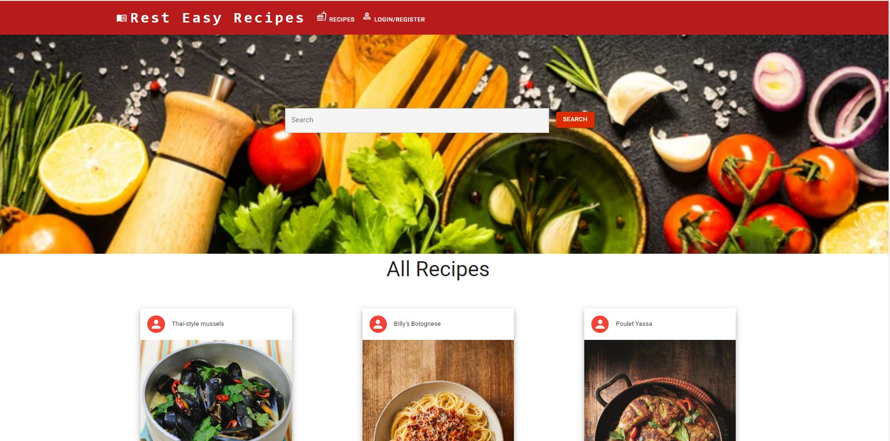
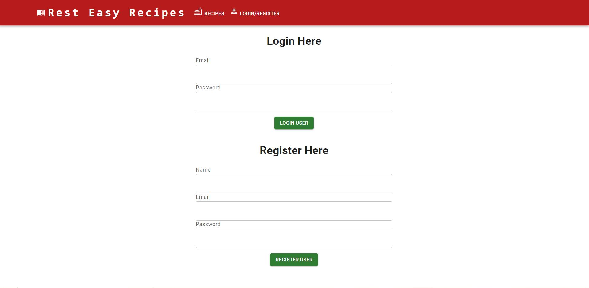
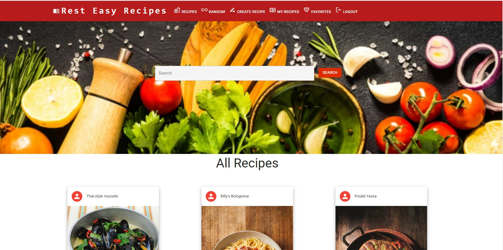
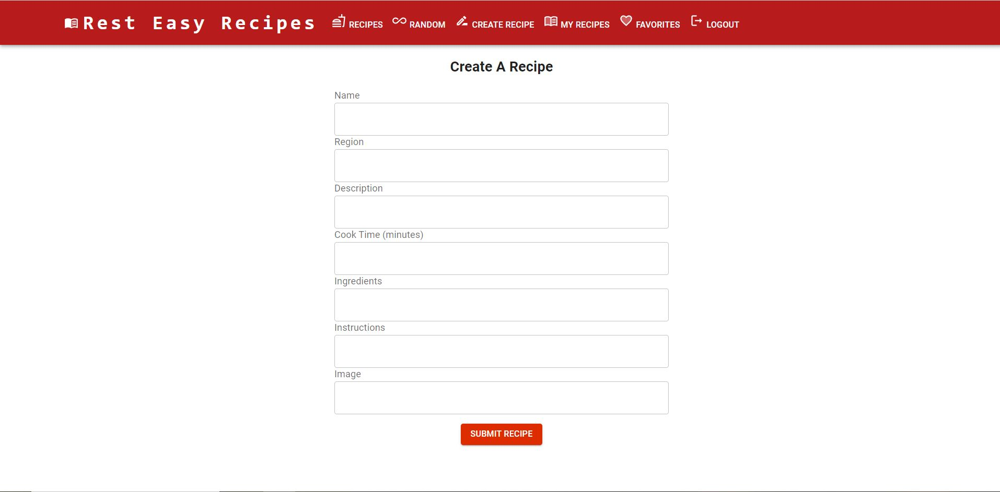

# Rest Easy Recipe!

## _Table Of Contents_

1. [Description](#description)
2. [Usage](#usage)
3. [Installation](#installation)
4. [License](#license)
5. [Criteria For Assignment](#criteria-for-assignment)
6. [Repo Link](#repository-link)
7. [Deployed Website](#deployed-website)
8. [Screen Shots](#screen-shots)

## Description

With this application our users will be able to search, add and rate recipes. The user will need to sign up or log in to their profiles. The user will be able to view saved recipes and post their own, including directions, ingredients and pictures. The user will be able to view other recipes and rate them with stars. The user will also have an option for a random recipe and be able to pick what style of food they are looking to make.

## Usage

Users can log in or sign up and find recipes they are able to try on their own. The user can also post their own recipes, which other users can rate. The user can try out random recipe button and be able to pick it by what style of food theyr'e looking to make.

## Installation

After cloning the repo you will need to use npm i to install stars-ratings, express, react and other needed npms.

## License

MIT

_Website for license_

[MIT License Website](https://mit-license.org/)

## Criteria-for-assignment

GIVEN a recipe blog

**WHEN I load the page**
*THEN I am able to see recipes by other users*

**WHEN click login/register**
*Then I am brought to a form to either login with my information or sign up for a login*

**WHEN I view a posted recipe**
*THEN I am able to click a drop down arrow to view more information on the recipe*

**WHEN I post my own recipes**
*THEN I am brought to a form where I can enter in the name of the dish, the region of the dish, ingredients, directions, the cook time for the recipe and add pictures of my recipe*

**WHEN I view the 'My Recipes' page**
*THEN I am able to see all the recipes I have created*

**WHEN I click on the star rating for a recipe**
*THEN I am able to change the rating of that recipe*

**WHEN I click the random recipe button**
*THEN I am given options on styles of dishes to choose from*

**WHEN I choose my desired random style**
*THEN I am given a random recipe that relates to the style I chose*

## Repository-Link

[Github](https://github.com/PintoDrop/resteasyrecipe)

## Deployed-Website

[Deployed Website]()

## Screen-Shots

